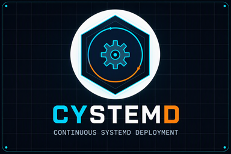

# CYSTEMD

**Continuous System-Daemon Deployment-Delivery** — a Go HTTP API that exposes `systemctl` actions over HTTP, with JWT authentication, service whitelisting, structured audit logging, and optional HashiCorp Vault AppRole authentication.

This file is the **reference**: endpoints, config keys, env vars, auth, building. Everything else — runbook, how-tos, ADRs, security model, architecture, history — is indexed in [`DOCS/README.md`](DOCS/README.md). Before changing a behaviour, read its ADR in [`DOCS/ADR/`](DOCS/ADR/README.md).

---

## Directory Layout

`main.go` is wiring only. The repo root also holds `go.mod`/`go.sum`, `example.config.yml`, `example.env`, `Makefile`, `Jenkinsfile`, `bitbucket-pipelines.yml`, `sonar-project.properties` and `logo/`. All logic lives in `internal/service/`:

| File | Role |
|---|---|
| `actions.go` | systemctl wrappers (start, stop, restart, enable, disable, status, version) |
| `api.go` | Generic HTTP handler, service whitelist, audit logging |
| `auth.go` | JWT authentication via Ed25519 public key |
| `cd.go` | Continuous deployment: git clone → config.yml + per-service values.yaml |
| `config.go` | YAML config loader, identity resolution, hot-reload, workdir management |
| `diff.go` | `/diff` and `/lastdiff` drift engine + cache |
| `dnfcache.go` | Scoped `dnf makecache` before an install ([ADR-0015](DOCS/ADR/0015-SCOPED-DNF-METADATA-REFRESH.md)) |
| `handlers.go` | Route registration, usage page, `/status`+`/version` concurrency cap |
| `logger.go` | Leveled logger (emergency → trace) |
| `metadata.go` | Build-time version metadata |
| `metrics.go` / `metrics_http.go` | Hand-rolled Prometheus exposition / HTTP RED middleware |
| `panicguard.go` | Panic boundary for background loops ([ADR-0014](DOCS/ADR/0014-PANIC-BOUNDARY-PER-CYCLE.md)) |
| `quota.go` | Live-state resolution of CPU/memory quotas ([ADR-0016](DOCS/ADR/0016-LIVE-UNIT-IS-THE-QUOTA-SOURCE-OF-TRUTH.md)) |
| `secrets.go` | Vault KV v1/v2 fetch → `.env`; per-service secrets; `.env` hot-reload |
| `sync.go` | `/sync` on-demand forced deploy |
| `templates.go` | Vault secret templating (`VAULT_TEMPLATES`) |
| `unit_metrics.go` | Managed-unit health metrics ([ADR-0010](DOCS/ADR/0010-UNIT-HEALTH-SAMPLED-AT-SCRAPE-TIME.md)) |
| `vault.go` / `vault_renewal.go` | Vault authentication / in-process Vault Agent (renewal + re-auth) |

Tests (`*_test.go`) sit beside the production files in the same package. See [Testing](#testing).

---

## Features

- **systemctl over HTTP:** restart, start, stop, enable, disable, status and version; a `/health` liveness probe; `/config` and `/env` (key names only, never values).
- **Identity from hostname:** managed services come from `node_pools`/`continuous_deployment`. A node in several pools manages every matching service, and each distinct `git_branch` is cloned once per cycle.
- **JWT (Ed25519):** an OpenSSH public key, with hot-reloadable rotation.
- **Kill watchdog:** a unit stuck `deactivating` is SIGKILLed after a grace derived from its **own** `TimeoutStopUSec`. `infinity` is never killed.
- **Audit and NDJSON logging:** every request, with client IP, action, service and result (`ALLOWED`/`DENIED`/`FAILED`).
- **Vault:** optional AppRole auth that is non-fatal, plus an in-process agent with lease-aware renewal and re-auth — no sidecar.
- **Continuous deployment:** git over SSH, YAML extraction, RPM version installs and CPU/memory quotas, all fail-soft. It never starts a stopped unit. A per-service `autosync` gate lets you observe drift without mutating anything, and `/sync` forces a deploy.
- **Self-update** when `version` in config.yml changes, and **hot reload** of config.yml and `.env` (30s polling).
- **Drift visibility:** `/diff` (live, read-only) and `/lastdiff` (cached).
- **Prometheus `/metrics`:** HTTP RED, audit/auth, Vault, secrets, templates, CD and managed-unit health.

---

## Configuration

Copy `example.config.yml` (fully commented) and adjust it. `service_name` and `allowed_services` are **not YAML keys**; cystemd derives them from the hostname:

```yaml
node_pools:
  - selector: myapplication
    nodes: [HOST001]
  - selector: myapplication3
    nodes: [HOST005, HOST006]
  - selector: myapplication4   # HOST005/006 are in BOTH pools — they manage
    nodes: [HOST005, HOST006]  # both myapplication3 AND myapplication4

continuous_deployment:
  - service: myproject_myapplication
    selector: myapplication
    replica: 1
    git_values: products/myproject/environments/dev/myproject_myapplication/values.yaml
    git_branch: master
    git_values_config_key: .${selector}.services.${selector}.config.[]
    git_values_cpu_key: .${selector}.services.${selector}.deployment.resources.limits.cpu
    git_values_memory_key: .${selector}.services.${selector}.deployment.resources.limits.memory
    git_values_version_key: .${selector}.global.image.tag
    service_config: target.config.yml     # default; can be omitted
    secrets: kubernetes/myproject/myapplication/myproject-myapplication-dev
    autosync: true                         # tolerant bool: true/yes/1 enable; false/no/0/omitted/unknown disable
  - service: myproject_myapplication4
    selector: myapplication4
    replica: 2
    git_values: products/myproject/environments/dev/myproject_myapplication4/values.yaml
    git_branch: master
    git_values_config_key: .${selector}.services.${selector}.config.[]
    git_values_version_key: .${selector}.global.image.tag
    secrets: kubernetes/myproject/myapplication4/myproject-myapplication4-dev
    workdir: /var
    autosync: false                        # observe-only: clone+inspect but never mutate the host

listen_address: ":50080"
log_level: debug
auth:
  enabled: true
  public_key_file: "/opt/cystemd/jwt_ed25519.pub"
```

**Identity resolution:** `os.Hostname()` is matched case-insensitively against every `node_pools[].nodes`, and **every** matching pool counts. The managed services are the `continuous_deployment[]` entries whose selector is one of those pools, deduplicated by `service` (first wins). The **primary** service is the first managed entry; it's used when `?service=` is omitted. `allowed_services`, the API whitelist, is every `continuous_deployment[].service` across all hosts. To stop managing a service, remove the host from that pool. An unmatched hostname logs a warning and manages nothing.

| Field | Default | Description |
|---|---|---|
| `dnf.makecache_repos` | — (disabled) | Repo IDs refreshed with `dnf makecache` right before each install, so a newly published build is visible without waiting out `metadata_expire`. **No repo name is compiled in.** Scoped, never a blanket refresh ([ADR-0015](DOCS/ADR/0015-SCOPED-DNF-METADATA-REFRESH.md)). Env: `CYSTEMD_DNF_MAKECACHE_REPOS` |
| `dnf.makecache_timeout` | `60s` | Bound on that refresh; on failure the install proceeds on cached metadata. Env: `CYSTEMD_DNF_MAKECACHE_TIMEOUT` |
| `listen_address` | `:50080` | Host/port to bind |
| `log_level` | `debug` | Minimum log severity |
| `version` | — (disabled) | cystemd's own RPM version. When it differs from the running `Version()` (or `Commit()`), cystemd installs `cystemd-${version}` and restarts. Refused on `dev`/`unknown` builds. See [Self-update](#self-update) |
| `auth.enabled` | `false` | Enable JWT verification. Env: `AUTH_ENABLED` |
| `auth.public_key_file` | — | Path to the OpenSSH Ed25519 public key. Env: `AUTH_PUBLIC_KEY_FILE` |
| `node_pools[].selector` / `.nodes` | — | Pool label / hostnames in the pool (case-insensitive) |
| `continuous_deployment[].service` | — | systemd unit name; contributes to `allowed_services`. Two entries may share a Service under different Selectors (PT/POC variants) |
| `continuous_deployment[].selector` | — | Matches a `node_pools[].selector` (pool membership only) |
| `continuous_deployment[].selectorkey` | `selector` | Overrides what `${selector}` expands to in the values keys, independently of pool membership |
| `continuous_deployment[].replica` | — | Target replica count (informational) |
| `continuous_deployment[].git_values` | — | Path in `GIT_REPOSITORY` to the source YAML |
| `continuous_deployment[].git_branch` | `master` | Branch for the `git_values` clone; each distinct branch is cloned once per cycle |
| `continuous_deployment[].git_values_config_key` | — | yq-style dot-path into `git_values`. `[]` takes a sequence's first element, or unwraps a single-key map (a YAML string inside is re-parsed — the Helm `config: { config.yml: "…" }` pattern); a multi-key map passes through. Written 2-space-indented with sorted keys to `${workdir}/${service}/${service_config}`; when omitted, the raw file goes to `values.yaml` |
| `continuous_deployment[].git_values_cpu_key` | — | Dot-path to a k8s CPU limit (`200m` → `CPUQuota=20%`), applied live with `systemctl set-property` (persistent drop-in, **no restart**); autosync-gated. Compared with the **live unit** ([ADR-0016](DOCS/ADR/0016-LIVE-UNIT-IS-THE-QUOTA-SOURCE-OF-TRUTH.md)). **Cumulative:** removing the key never clears an applied limit — remove it from the values file first, then `systemctl revert` |
| `continuous_deployment[].git_values_memory_key` | — | The same for `MemoryMax` bytes (`1Gi` → `1073741824`; `Ki…Ei` = 1024ⁿ, `k…E` = 1000ⁿ) |
| `continuous_deployment[].git_values_version_key` | — | Dot-path to a version tag. Drives `dnf -y install ${service}-${version}`, `daemon-reload`, and a restart of a running unit. Compared with the **rpm database**, so a package moved outside cystemd is converged; `.installed_version` is only a breadcrumb ([ADR-0011](DOCS/ADR/0011-RPM-IS-THE-INSTALLED-VERSION-SOURCE-OF-TRUTH.md)) |
| `continuous_deployment[].service_config` | `target.config.yml` | Output filename for the config-key extraction |
| `continuous_deployment[].secrets` | — | Vault path, written to `${workdir}/${service}/.env` |
| `continuous_deployment[].workdir` | `/opt` | Base directory; the service directory is `${workdir}/${service}` |
| `continuous_deployment[].autosync` | `false` | Tolerant bool (`true`/`yes`/`1`; anything else is **false**). Enabled: may install, rewrite `.env`/`${service_config}` and restart running units. Disabled: inspects, never mutates. See [Per-service `autosync` gate](#per-service-autosync-gate) |
| `vault.refresh_interval` | `1m` | Secret-refresh cadence; `0` disables. Env: `VAULT_REFRESH_INTERVAL` |
| `vault.renewal_interval` | `30m` | **Ceiling** of the lease-aware renewal loop; `0` disables. Env: `VAULT_RENEWAL_INTERVAL` |
| `vault.renewal_floor` | `10s` | **Floor** of that loop, and the threshold at which a shrinking lease triggers a re-auth. `0` falls back to the default. Hot-reloadable. Env: `VAULT_RENEWAL_FLOOR` |

CD settings (`GIT_*`) deliberately have no `config.yml` keys (see [Continuous Deployment](#continuous-deployment)). The config path is `CYSTEMD_CONFIG`, else `/opt/cystemd/config.yml`; `CYSTEMD_LOG_LEVEL` overrides the log level.

---

## Authentication

### JWT (per-request)

With `auth.enabled: true`, the mutating and file endpoints require a JWT signed with the configured Ed25519 key: `/restart`, `/start`, `/stop`, `/enable`, `/disable`, `/config`, `/env`, `/sync`, `/diff` and `/lastdiff`. Pass it as `curl -H "Authorization: Bearer <token>" "http://host:50080/restart"`. `/health`, `/status`, `/version`, `/metrics` and `/` stay open.

The public key (OpenSSH format, `ssh-ed25519 AAAAC3Nz... user@host`) can be given inline in `AUTH_PUBLIC_KEY`, which beats `public_key_file`. `AUTH_PUBLIC_KEY_FILE` is a different setting that holds a **path**. To create the keypair and mint a token, see [HOWTO § Mint a JWT](DOCS/HOWTO.md#mint-a-jwt).

**The key must be dedicated to cystemd.** Any token it signs with an `exp` claim authorizes every mutating endpoint on every host that shares the key. There's no audience/issuer check ([ADR-0006](DOCS/ADR/0006-JWT-SCOPE.md)).

### Vault authentication methods — why AppRole?

cystemd is a long-lived unit on bare-metal, often air-gapped, Red Hat hosts. **AppRole** needs only HTTPS to Vault. It's two-factor (a Role ID or Secret ID is useless alone), it issues **short-lived tokens from a long-lived bootstrap credential**, and Secret IDs can be CIDR-bound, use- or TTL-limited, and revoked. The alternatives don't fit a daemon on this fleet: Kubernetes (these are bare-metal hosts), cloud IAM (it couples auth to one provider), LDAP/userpass/OIDC (interactive or chicken-and-egg), and TLS certificates (they need a managed PKI).

**`VAULT_TOKEN` is the last-resort fallback.** It's there for an external Vault Agent writing `.env`, or for dev/test. It doesn't renew: on expiry the loop re-applies the same revoked token. Use AppRole in production.

**Recommended AppRole role:** Secret IDs that never expire, and short-lived tokens that cystemd renews.

```bash
vault write auth/approle/role/cystemd \
    secret_id_ttl=0 secret_id_num_uses=0 \
    token_ttl=24h token_max_ttl=24h \
    bind_secret_id=true secret_id_bound_cidrs="10.0.0.0/8" \
    token_policies="default,cystemd-reader"
vault write -f auth/approle/role/cystemd/secret-id
chmod 600 /opt/cystemd/.env && chown cystemd:cystemd /opt/cystemd/.env
```

cystemd **enforces** 0600 on `/opt/cystemd/.env` and on every `${workdir}/${service}/.env` every cycle.

#### Response-wrapped SecretID (optional hardening)

[Response wrapping](https://developer.hashicorp.com/vault/DOCS/concepts/response-wrapping) keeps a single-use, short-TTL wrapping token on disk instead of the raw SecretID. Run `vault write -wrap-ttl=90s -f auth/approle/role/cystemd/secret-id`, then put the returned `wrapping_token` in `.env` as `VAULT_WRAPPING_TOKEN=hvs.XXXX`.

**Authentication priority:** each configured method is tried in order, and a failure falls through to the next ([ADR-0009](DOCS/ADR/0009-VAULT-AUTH-FALLBACK-CHAIN.md)).

| Priority | Method | Requires |
|---|---|---|
| 1 | AppRole via `VAULT_WRAPPING_TOKEN` | `VAULT_ROLE_ID` |
| 2 | AppRole via `VAULT_SECRET_ID` | `VAULT_ROLE_ID` |
| 3 | `VAULT_TOKEN` | — |

**A fallback logs a `WARNING`** that names the failed methods. If every method fails, cystemd runs degraded. To fail loudly rather than downgrade, configure *only* a wrapping token.

The wrapping token is unwrapped once, and the SecretID is held in memory, so the unwrapped SecretID must be multi-use (`secret_id_num_uses=0`). Rotating it needs a `systemctl restart cystemd` within the token's `wrap_ttl`. `VAULT_SECRET_ID` always holds a raw SecretID. There's **no `VAULT_SECRET_ID_WRAPPED` flag**: the presence of `VAULT_WRAPPING_TOKEN` selects wrapped mode.

### Vault AppRole (startup) & Degraded Mode

Vault auth is **optional and non-fatal**: bad credentials or an unreachable Vault never crash cystemd ([ADR-0001](DOCS/ADR/0001-VAULT-FAILURE-IS-NON-FATAL.md)). With `VAULT_ADDRESS` unset, Vault is skipped. With credentials missing, or auth failing (403, unreachable), cystemd logs a Warning and runs degraded without a client:

```json
{"level":"warning","msg":"vault: initialisation failed — continuing without Vault client (degraded mode): vault: AppRole login failed: 403 Forbidden: permission denied","time":"2026-05-11T16:32:53Z"}
```

`/` reports this as `"vault": {"configured": true, "status": "unauthenticated", ...}`; an unconfigured host shows `{"configured": false, "status": "not_configured"}`. `secret_id_wrapped` shows which credential variable the host reads, never a credential. All `systemctl` endpoints keep working. To recover, fix `/opt/cystemd/.env`: the hot-reload picks it up within 30s and the next renewal tick re-authenticates.

---

## Environment Variables

Copy `example.env` to `/opt/cystemd/.env`; the unit must have `EnvironmentFile=/opt/cystemd/.env`. Booleans accept `true`/`yes`/`1` and `false`/`no`/`0`, case-insensitively. An invalid value reverts to the default, with a warning.

| Variable | Required | Default | Description |
|---|---|---|---|
| `CYSTEMD_CONFIG` | No | `/opt/cystemd/config.yml` | Path to the YAML config |
| `CYSTEMD_LOG_LEVEL` | No | config value | Runtime log level override |
| `CYSTEMD_DNF_MAKECACHE_REPOS` | No | config value | Comma-separated repo IDs refreshed before each install; empty disables |
| `CYSTEMD_DNF_MAKECACHE_TIMEOUT` | No | config value (`60s`) | Bound on that refresh; the install proceeds regardless |
| `AUTH_ENABLED` | No | config value | Enable/disable JWT |
| `AUTH_PUBLIC_KEY_FILE` | No | config value | Path to the OpenSSH Ed25519 public key. Ignored when an inline key is set |
| `AUTH_PUBLIC_KEY` | No | — | The key **inline**. Highest precedence |
| `PUBLIC_KEY` | No | — | **Deprecated** spelling of `AUTH_PUBLIC_KEY`, still honoured with a Warning |
| `VAULT_ADDRESS` | No | — | Vault URL. Omit it to disable Vault |
| `VAULT_TOKEN` | No* | — | Direct token. **Priority 3**, the last fallback |
| `VAULT_ROLE_ID` | No* | — | AppRole RoleID |
| `VAULT_SECRET_ID` | No* | — | AppRole SecretID (always raw). Priority 2 |
| `VAULT_WRAPPING_TOKEN` | No* | — | Single-use response-wrapping token. **Priority 1**; its presence selects wrapped mode |
| `VAULT_SKIP_VERIFY` | No | `true` | Disable TLS verification. **Set `false` in production** |
| `VAULT_PATH` | No | `kubernetes/devtools/cystemd/cystemd` | Logical secret path (never include `/data/`) |
| `VAULT_ENV_FILE` | No | `.env` | Destination for fetched secrets. The default, cystemd's own `.env`, is the fleet standard, so the secret must carry every key ([ADR-0018](DOCS/ADR/0018-VAULT-RENDERS-CYSTEMD-ENV.md)) |
| `VAULT_TEMPLATES` | No | — | `source:destination[:reload]` entries rendered from KV. See [Vault Secret Templating](#vault-secret-templating) |
| `VAULT_REFRESH_INTERVAL` | No | `1m` | Secret-refresh cadence; `0` disables |
| `VAULT_RENEWAL_INTERVAL` | No | `30m` | Renewal-loop ceiling; `0` disables |
| `VAULT_RENEWAL_FLOOR` | No | `10s` | Renewal-loop floor and collapsed-lease re-auth threshold; `0` falls back to the default |
| `GIT_SSH_KEY_PRIVATE` | No | — | SSH private key for the CD clone: raw PEM or a path, auto-detected |
| `GIT_SSH_KNOWN_HOSTS` | No | — | `known_hosts` path (accept-new/TOFU; a missing file is created). Unset disables verification — set it in production |
| `GIT_REPOSITORY` | No | — | SSH URL of the GitOps repo. Empty disables CD |
| `GIT_CONFIGURATION` | No | — | Path within the repo to persist locally |
| `GIT_CONFIGURATION_LOCAL` | No | resolved `CYSTEMD_CONFIG` | Local destination; clearing it at runtime reverts to the default |
| `GIT_INTERVAL` | No | `3m` | CD cadence; `0` disables |

\* With `VAULT_ADDRESS` set, supply `VAULT_ROLE_ID` plus `VAULT_WRAPPING_TOKEN` or `VAULT_SECRET_ID`, and/or `VAULT_TOKEN`. Treat `VAULT_SECRET_ID` as a password.

---

## API Endpoints

All endpoints are `GET` only (`405` otherwise). They take an optional `?service=<name>`, defaulting to the primary service; the name must match `^[a-zA-Z0-9:._@-]+$` before the whitelist check (else `400`).

| Endpoint | Auth | Response | Description |
|---|---|---|---|
| `/health` | open | JSON | Liveness: always `{"status":"ok"}`, with no D-Bus or subprocess |
| `/restart`, `/start`, `/stop` | JWT | text | Act on the unit, then append its status |
| `/enable`, `/disable` | JWT | text | Boot-time enablement |
| `/config` | JWT | text | The managed service's runtime config file |
| `/env` | JWT | text | Variable **key names** only, sorted |
| `/sync` | JWT | text | Force-deploy all managed services regardless of `autosync`; host-scoped |
| `/diff` | JWT | JSON | Live, read-only diff against upstream; host-scoped |
| `/lastdiff` | JWT | JSON | Cached diff; host-scoped, no I/O |
| `/status` | open | JSON | Structured unit status |
| `/version` | open | JSON | RPM metadata |
| `/metrics` | open | text | Prometheus exposition |
| `/` | open | JSON | Usage page; catch-all for unregistered paths |

Common errors: `401` missing/invalid JWT · `403` not whitelisted · `400` invalid/missing name · `405` non-GET. Per-endpoint logging: [Endpoint logging coverage](#endpoint-logging-coverage).

### `/metrics`

Prometheus text exposition (`0.0.4`) of the whole process: counters, timestamps, gauges and lease durations, never a secret or a token. It's hand-rolled with no client library ([ADR-0002](DOCS/ADR/0002-NO-METRICS-CLIENT-LIBRARY.md)) and works with an OTel Collector.

| Metric | Type | Meaning |
|---|---|---|
| `cystemd_build_info{version,commit,go_version}` | gauge | Constant `1`; build identity |
| `target_info{service_name,service_version,host_name}` | gauge | Constant `1`; OTel resource attributes |
| `process_start_time_seconds` | gauge | Start time (unix s) |
| `go_goroutines`, `go_memstats_{alloc,sys,heap_inuse,next_gc}_bytes` | gauge | Go runtime |
| `cystemd_http_requests_total{path,method,status}` | counter | HTTP RED; unknown paths → `path="other"` |
| `cystemd_http_request_duration_seconds{path}` | histogram | Request duration |
| `cystemd_audit_total{result}` | counter | `allowed`/`denied`/`failed` |
| `cystemd_panic_recovered_total{loop}` | counter | Panics recovered in a background loop — a **bug**; **alert on any non-zero value** ([ADR-0014](DOCS/ADR/0014-PANIC-BOUNDARY-PER-CYCLE.md)) |
| `cystemd_auth_total{result}` | counter | `accepted`/`missing`/`invalid` (auth enabled only) |
| `cystemd_vault_up` | gauge | `1` live client, `0` degraded/unconfigured |
| `cystemd_vault_token_lease_duration_seconds` | gauge | Lease **granted at the last renewal**, not the remaining TTL |
| `cystemd_vault_token_renewable` | gauge | `1` if renewable |
| `cystemd_vault_token_renewal_total{result}` | counter | `success`/`reauth`/`failure`, one per cycle |
| `cystemd_vault_token_last_renewal_timestamp_seconds` | gauge | Last successful renewal |
| `cystemd_secret_fetch_total{result}` / `cystemd_secret_last_fetch_timestamp_seconds` | counter/gauge | Vault secret reads |
| `cystemd_template_render_total{result}` / `_last_render_timestamp_seconds` / `cystemd_template_reload_total{result}` | counter/gauge | Templating |
| `cystemd_cd_cycle_total{result}` / `cystemd_cd_last_success_timestamp_seconds` | counter/gauge | CD cycle outcome |
| `cystemd_cd_clone_total{result}` | counter | Git clones (main + per-branch `git_values`) |
| `cystemd_cd_install_total{result}` | counter | RPM installs actually attempted, self-update included |
| `cystemd_cd_restart_total{result}` | counter | Automated restarts (running units only) |
| `cystemd_unit_active_state{service,state}` | gauge | **Managed unit** `ActiveState` as a state set — exactly one `1` per service |
| `cystemd_unit_restarts_total{service}` | counter | **Managed unit** `NRestarts` |
| `cystemd_unit_health_scrape_ok` | gauge | `1` if the last managed-unit sample reached systemd |

```promql
cystemd_vault_token_lease_duration_seconds - (time() - cystemd_vault_token_last_renewal_timestamp_seconds)  # remaining TTL
cystemd_vault_up == 1 and (time() - cystemd_vault_token_last_renewal_timestamp_seconds) > 900             # alert: renewals stalled
(time() - cystemd_cd_last_success_timestamp_seconds) > 900                                                  # alert: CD loop stale
rate(cystemd_cd_cycle_total{result="failure"}[15m]) > 0                                                     # alert: CD cycles failing
cystemd_unit_active_state{state="failed"} == 1                                                              # alert: managed unit failed
increase(cystemd_unit_restarts_total[15m]) > 3                                                              # alert: crash-looping
cystemd_unit_health_scrape_ok == 0   # alert: unit health blind — the unit series are ABSENT then, so alert on this flag
```

Fixed-label families emit every series on every scrape, zeros included; labeled families (HTTP, audit, auth) emit only the combinations that occurred. The three `cystemd_unit_*` families are **sampled from systemd at scrape time**, because systemd owns unit state ([ADR-0010](DOCS/ADR/0010-UNIT-HEALTH-SAMPLED-AT-SCRAPE-TIME.md)). One D-Bus connection reads every managed unit, and the sample is memoised for 5s. Every state is emitted per unit, so a recovered unit leaves no stale `failed` series. An unreadable unit reports `0` for every state. `cystemd_unit_restarts_total` is omitted for unit types without `NRestarts`, and it resets on `systemctl reset-failed`.

**OpenTelemetry:** there's no OTel SDK dependency and no in-process OTLP push. Instead, the Collector's `prometheus` receiver scrapes `/metrics` (`target_info` → resource attributes):

```yaml
receivers:
  prometheus/cystemd:
    config:
      scrape_configs:
        - job_name: cystemd
          metrics_path: /metrics
          static_configs:
            - targets: ['10.11.12.10:50080', '10.11.12.11:50080']
exporters:
  otlp:
    endpoint: otelcol-backend:4317
service:
  pipelines:
    metrics:
      receivers: [prometheus/cystemd]
      exporters: [otlp]
```

### `/restart`, `/start`, `/stop`

These act on the unit over D-Bus, then print its `systemctl status` after `--- Status ---`. `/restart` and `/stop` use a **kill watchdog**. It waits the unit's own `TimeoutStopUSec` plus 2s, capped at 60s (3s when unreadable), and then SIGKILLs a unit still `deactivating`. `infinity` is never killed. It's only a backstop for a wedged systemd ([ADR-0007](DOCS/ADR/0007-WATCHDOG-GRACE-FROM-UNIT-POLICY.md)). Requests are bounded at 120s. Errors: `401` · `403` · `400` · `500` D-Bus error.

### `/enable` / `/disable`

Toggle boot-time enablement. The response has one line per symlink created or removed, and no status. Errors: `401` · `403` · `400` · `500`.

### `/config` / `/env`

`/config` returns `${workdir}/${service}/${service_config}` verbatim from the matching managed entry. `/env` returns the sorted **key names** of `${workdir}/${service}/.env`, never values. A whitelisted but unmanaged service gets `500`. Errors: `401` · `403` · `400` · `500` (no CD entry, or the file is missing).

### `/sync`

Immediately syncs **every** service this host manages — `${service_config}`, version, quota, Vault `.env` — **regardless of `autosync`**. Each surface still skips when it's in sync, and a stopped unit is still never started. It excludes the main `config.yml` clone and self-update. It's host-scoped (`?service=` is ignored) and serialized with CD by a mutex: a busy sync returns at once instead of queueing.

```
forced sync of 2 service(s) on this host (autosync override): myproject_myapplication3, myproject_myapplication4
- values/version/quota: attempted for all managed services (see journal for details)
- secrets: attempted for all managed services (see journal for details)
```

Errors: `401` · `405` · `500` (busy, or no managed service).

### `/diff` / `/lastdiff`

`/diff` is a live, read-only comparison against upstream; it writes, installs and restarts nothing. For each service it reports:
- `config`: a YAML property diff (`+`/`-`/`~`), or a line diff for non-YAML.
- `version`: installed (from the rpm database) against upstream, with `changed`.
- `env`: variable **names** added, changed or removed, never values.

It's capped at 2 concurrent computations. `/lastdiff` returns the cached result with no clone or Vault read; CD, the secrets refresh and `/diff` all fill the cache. Poll `/lastdiff` from dashboards.

```json
{
  "generated_at": "2026-07-13T09:00:00Z",
  "services": [
    {
      "computed_at": "2026-07-13T09:00:00Z",
      "config": ["~ app.replicas: 2 -> 3"],
      "env": {"added": ["NEW_KEY"], "changed": [], "removed": []},
      "service": "myapplication",
      "version": {"changed": true, "current": "1.2.0", "wanted": "1.3.0"}
    }
  ]
}
```

Errors: `401` · `405` · `500` (cap reached, or no managed service).

### `/status`

Structured unit status. A D-Bus failure returns a JSON error object with HTTP 200. The exception is the concurrency cap: `/status` and `/version` share 8 slots and answer **`503`** beyond that.

```json
{
  "active_duration": "1h 0min ago",
  "active_since": "2026-04-21T08:00:00Z",
  "active_since_human": "Mon 2026-04-21 08:00:00 WIB",
  "active_state": "active",
  "cgroup": "/system.slice/myapp.service",
  "cpu_quota_per_sec_usec": 500000,
  "cpu_quota_percent": "50%",
  "cpu_usage_ns": 12800000000,
  "description": "My Application Service",
  "drop_ins": ["/etc/systemd/system/myapp.service.d/50-cpu-quota.conf"],
  "fragment_path": "/usr/lib/systemd/system/myapp.service",
  "load_state": "loaded",
  "main_pid": 12345,
  "main_pid_comm": "myapp",
  "memory_current_bytes": 104857600,
  "memory_max_bytes": 536870912,
  "memory_peak_bytes": 209715200,
  "n_restarts": 3,
  "processes": [
    { "command": "/opt/myapp/bin/myapp --config /opt/myapp/target.config.yml", "pid": 12345 }
  ],
  "sub_state": "running",
  "tasks_current": 24,
  "tasks_max": 4915,
  "unit": "myapp.service",
  "unit_file_preset": "disabled",
  "unit_file_state": "enabled"
}
```

Every emittable field is shown above, and zero/empty fields are omitted, except `n_restarts`. `drop_ins` shows where a CD-applied quota lives. `cpu_quota_*` and `memory_max_bytes` are omitted when no quota is set.

`n_restarts` is systemd's `NRestarts`, which counts **automatic** restarts under `Restart=`. An explicit restart doesn't advance it, and `systemctl reset-failed` clears it. It's present whenever it can be read, **including `0`**, and absent only when unreadable (for example on a `.target`), so `0` means healthy and absent means unknown ([`DOCS/DESIGN-N-RESTARTS-ZERO-VS-ABSENT.md`](DOCS/DESIGN-N-RESTARTS-ZERO-VS-ABSENT.md)). Errors: `400` · `403` · `405` · `503` cap.

### `/version`

The output of `rpm -qi <service>` as JSON, sharing `/status`'s cap. `build_date`, `build_host`, `group`, `install_date` and `url` are omitted when empty.

```json
{"architecture": "x86_64", "group": "My Group", "license": "Apache-2.0", "name": "cystemd", "release": "1.el9", "signature": "(none)", "size": 15285821, "source_rpm": "cystemd-v4.6.1-1.el9.src.rpm", "summary": "api", "url": "https://bitbucket.org/my-workspace/cystemd", "vendor": "cystemd", "version": "v4.6.1"}
```

Errors: `403` · `400` · `500` (rpm missing, or the package isn't installed) · `503` cap.

### `/` and `/health`

`/` is a JSON usage page. It shows server identity (`server.build_time`, `commit`, `go_version`, `hostname`, `ip`, `listen_address`, `service` — always `cystemd` — `vault`, `version`) and the endpoint catalogue, with two ready-to-run `curl` examples per endpoint: HTTPS and direct IP. It also catches unregistered paths (`/restartt` lands here, not `404`). The `vault` block shows only `address`, `auth_method`, `configured`, `lease_duration`, `renewable`, `secret_id_wrapped` and `status`, never a token. `/health` is liveness only, with no `?service=` and no JWT.

```bash
curl "http://10.11.12.10:50080/restart"                                   # default service
curl -H "Authorization: Bearer <token>" "http://10.11.12.10:50080/restart?service=myproject_myapplication5"
curl "https://my-lb-host/myapplication/status"                            # via load balancer path prefix
```

---

## Building

```bash
make build            # recommended — go mod tidy + injects version metadata, CGO disabled
go build -o cystemd . # no metadata; target the root package — "./..." fails (-o needs one target)
./cystemd --version   # version / commit (40 hex) / build_time (+0700) / go_version
```

### Build metadata contract

| Field | Source | Required shape |
|---|---|---|
| `version` | `git describe --tags --exact-match HEAD` | The exact tag on HEAD, or **empty** when untagged (the build is then identified by `commit`) |
| `commit` | `git rev-parse HEAD` | **Full 40-char hex**, never `--short` |
| `build_time` | `TZ=Asia/Jakarta date +%Y-%m-%dT%H:%M:%S%z` | `YYYY-MM-DDTHH:MM:SS+0700` (WIB) |
| `go_version` | `runtime.Version()` | `goX.Y.Z` |

Binaries built before 2026-07-15 report the nearest *ancestor* tag. `TestCommit_WhenInjected_IsFullGitHash` and `TestBuildTime_WhenInjected_IsJakartaISO8601` catch drift.

## Running

On a managed host, install the RPM, in the order [`DOCS/INSTALL.md`](DOCS/INSTALL.md) gives. By hand:

```bash
./cystemd                                                     # default config path, no Vault
VAULT_ADDRESS="https://vault.example.com" VAULT_ROLE_ID="…" VAULT_SECRET_ID="…" ./cystemd
CYSTEMD_CONFIG=/etc/cystemd/config.yml CYSTEMD_LOG_LEVEL=trace ./cystemd
```

---

## Vault Secret Fetch

After auth, cystemd reads `VAULT_PATH` and writes `VAULT_ENV_FILE` as sorted `KEY=VALUE` lines. The file is 0600, values are quoted when needed, and the write is atomic.
- **KV v2, then v1:** configure `VAULT_PATH` as the logical path (never `/data/`).
- **Fail-soft:** every failure logs and returns.
- **Values:** strings, bools and numbers are written as-is; nested values are JSON-encoded, byte-stable so they cause no phantom rewrites. For PEMs and other structured files, use [templating](#vault-secret-templating).
- **Refresh:** every `VAULT_REFRESH_INTERVAL`; unchanged content isn't rewritten.
- **Rendering into cystemd's own `.env`** is the fleet standard ([ADR-0018](DOCS/ADR/0018-VAULT-RENDERS-CYSTEMD-ENV.md)). A key missing from the secret disappears from `.env`. Keys read only at startup take effect at the next restart, and other `EnvironmentFile=` consumers re-read only when they restart.

### Delivering secrets to multiple consumer services (per-secret restart)

Add one secrets-only `continuous_deployment[]` entry per consumer, leaving the values, version and quota keys empty. These entries run on the Vault refresh ticker.

```yaml
continuous_deployment:
  - selector: web-pool
    service: consumer-a
    secrets: kv/app/consumer-a
    autosync: true                # REQUIRED — enables the .env write AND the restart
  - selector: web-pool
    service: consumer-c
    secrets: kv/app/shared-x      # two consumers on the same path both restart when it rotates
    autosync: true
```

**Restart invariant:** cystemd never restarts a service on its own unless its entry has `autosync: true`. Without it, the only restarts are operator-initiated: `/sync`, `/restart`, or a template reload hook. Restarts happen per Vault path; to merge several paths into one `.env`, use templating.

## Vault Secret Templating

Renders operator-provided Go `text/template` files from Vault KV into real files — PEMs, multi-line configs, JSON.

```bash
VAULT_TEMPLATES="/opt/cystemd/templates/app.conf.tmpl:/opt/app/app.conf;/opt/cystemd/templates/tls.pem.tmpl:/etc/ssl/app/tls.pem"
VAULT_TEMPLATES="/opt/cystemd/templates/tls.pem.tmpl:/etc/ssl/app/tls.pem:systemctl reload nginx"   # 3rd field: reload command
```

Templates can use `{{ secretField "kv/path" "field" }}`, which errors if the field is absent, and `{{ (secret "kv/path").FIELD }}`. Files render at startup and on every refresh tick. Outputs are 0600, written atomically, and never logged. The render **fails closed**: a missing field leaves the destination unchanged. The reload command runs through `sh -c` with a 30s bound, only when the file changed. Only KV reads are supported (no `pki/issue`-style endpoints). An empty `VAULT_TEMPLATES` disables templating.

## In-Process Vault Agent (Token Renewal)

There's no external `vault-agent`. `StartVaultRenewal` renews on a **lease-aware** schedule: `min(VAULT_RENEWAL_INTERVAL, 2/3 × lease)`, floored at `VAULT_RENEWAL_FLOOR`. A 1h TTL renews at about 40m. Each cycle calls renew-self; if that fails it does a fresh AppRole login, and if both fail it logs a Warning and retries.
- **Reaching `max_ttl`:** Vault returns ever-shorter leases instead of an error. When `2/3 × lease` drops below the floor, cystemd **re-authenticates immediately**, while the token is still valid.
- **Backoff:** with no live token, retries back off from 10s up to the ceiling, so an outage recovers in seconds. There's no 4xx fail-fast, because a new SecretID in `.env` can fix a 403.
- **Recovery:** a failed startup login still starts the loop, so no restart is needed.

### Parity with HashiCorp Vault Agent

Audited in July 2026 against Vault 2.0.x, for a KV-only, AppRole, systemd setup. The embedded agent covers auto-auth with re-auth, lease-aware renewal, backoff, secret fetch and templating with reload hooks.

**Known gaps, in priority order:**
- No `VAULT_CACERT` or client-cert mTLS; this is the one worth closing.
- No one-shot mode. For a consumer that may start first, use `EnvironmentFile=-/path/.env`.
- No token sink.
- No backoff jitter.
- No Enterprise namespaces or KV-version pinning.

**Not gaps:** the Agent API proxy/cache (deprecated in favour of Vault Proxy), event-driven caching (Vault Proxy + Enterprise), and the `exec` supervisor (systemd does that job).

---

## Self-update

cystemd installs and restarts itself when the top-level `version` in `config.yml` differs from the running binary's `Version()` (or `Commit()`). To upgrade the fleet, bump `version` in the GitOps repo: CD distributes it, and each host updates itself.

The decision tree lives in `RunSelfVersionInstall` (`cd.go`):
1. `version` unset: skip.
2. A `dev` or `unknown` build: refuse. A local build never auto-installs over itself.
3. Clean up any duplicate cystemd RPMs.
4. `version` matches `Version()` or `Commit()`: skip.
5. Otherwise: install `cystemd-${version}` in a `systemd-run --scope`, so the install survives the restart, then restart.

It runs at startup, whenever `config.yml` changes, and at the end of each CD cycle, which retries a failed `dnf`. **The restart is abrupt**: in-flight requests are cut. A failed install logs a Warning and is retried next cycle. Details: [`DOCS/CLAUDE.md`](DOCS/CLAUDE.md) *Self-update*.

## Continuous Deployment

Every `GIT_INTERVAL` (default `3m`), cystemd clones `GIT_REPOSITORY` into a temp dir, reads `GIT_CONFIGURATION`, and saves it to `GIT_CONFIGURATION_LOCAL`, which defaults to cystemd's own config. An empty `GIT_REPOSITORY` disables CD.

```bash
# .env (typical)
GIT_REPOSITORY="git@bitbucket.org:mycompany/kubernetes.git"
GIT_CONFIGURATION="products/devtools/environments/dev/devtools_cystemd/config.yml"
GIT_SSH_KEY_PRIVATE=/opt/cystemd/cd_id_ed25519
GIT_SSH_KNOWN_HOSTS=/opt/cystemd/known_hosts
```

- **Why `.env` and not `config.yml`:** CD overwrites its target every cycle, so a single push that dropped the settings would disable CD on every host. `.env` is never overwritten by CD ([ADR-0005](DOCS/ADR/0005-CD-CONFIG-IS-ENV-ONLY.md)).
- **Authentication:** `GIT_SSH_KEY_PRIVATE` is a raw PEM or a path; passphrase-protected keys aren't supported. `GIT_SSH_KNOWN_HOSTS` works accept-new/TOFU. To pin up front: `ssh-keyscan bitbucket.org >> /opt/cystemd/known_hosts && chmod 600 /opt/cystemd/known_hosts`.

### Per-service `autosync` gate

`continuous_deployment[].autosync` (tolerant bool, default **false**) decides whether cystemd may change the host for that service ([ADR-0003](DOCS/ADR/0003-AUTOSYNC-GATES-WRITES-NOT-READS.md)):
- **`true`:** it writes `.env` and `${service_config}`, installs on version drift, restarts running units when any of those change, and applies CPU/memory quotas live.
- **`false`** (or omitted, or unrecognised): drift detection still runs, and one Info line is logged per drifted artifact, but nothing is written, installed or restarted.

The gate covers only managed services; cystemd's own `config.yml`/`.env` stay fully managed. Every step is fail-soft, so the API is never affected. Every managed file is written atomically (temp + rename, `O_EXCL`, symlinks never followed).

## Hot Reload

`config.yml` and `.env` are polled every 30s and applied in place.

| Change | Effect |
|---|---|
| `node_pools`, `continuous_deployment` | Managed services and the whitelist are recalculated |
| `log_level` | Immediate |
| `auth.public_key_file`, `PUBLIC_KEY`, `AUTH_PUBLIC_KEY_FILE` | `InitAuth` re-runs (key rotation) |
| `version` | Self-update runs |
| `dnf.makecache_*` | Re-read on a **config.yml** change; editing only the env vars needs a restart |
| Vault credentials in `.env` | Used by the next re-auth |
| `GIT_REPOSITORY`, `GIT_CONFIGURATION`, `GIT_CONFIGURATION_LOCAL`, `GIT_SSH_*` | Read fresh every CD cycle |
| **Restart required** | `listen_address`, `GIT_INTERVAL`, `AUTH_ENABLED`, `vault.refresh_interval`/`renewal_interval` (running tickers keep their cadence) |

---

## JSON Response Format

Every JSON response has its top-level keys in **alphabetical order**, enforced by `json_sort_test.go`.

## Audit Log Format

```json
{"level":"info","msg":"[AUDIT] 2026-02-20T11:25:00Z | Client=10.11.12.10 | Action=/restart | Service=myproject_myapplication5 | Result=ALLOWED | Duration=42ms","time":"2026-02-20T11:25:00Z"}
```

Filter with `journalctl -u cystemd.service -f -o cat | jq -c 'select(.msg | startswith("[AUDIT]"))'`.
- `Result` is `ALLOWED` (completed), `DENIED` (not whitelisted, or no service) or `FAILED` (non-zero exit).
- `Client` is the first `X-Forwarded-For` entry, else `RemoteAddr`; when the two disagree, the line also logs `RemoteAddr`.

### Endpoint logging coverage

| Endpoint | Journal line per request |
|---|---|
| `/restart`, `/start`, `/stop`, `/enable`, `/disable`, `/config`, `/env`, `/status`, `/version` | One `[AUDIT]` |
| `/sync`, `/diff`, `/lastdiff` | One `[AUDIT]` per managed service |
| `/` | Debug only, not `[AUDIT]` |
| `/health`, `/metrics` | None (silent, 405s included) |

### Response-time coverage

`InstrumentHTTP` records one observation per request for every route and the catch-all. Unknown paths and methods are labelled `"other"`. **Three fidelity gaps:**
- **Buckets top out at 10s** (`httpDurationBuckets` in `metrics.go`), so slow `/diff` requests land in `+Inf`. Use the mean instead: `rate(…_sum[5m]) / rate(…_count[5m])`.
- **Labeled by path only**, so a fast 500 and a slow 200 average together.
- **No phase breakdown:** you can see *that* a request was slow, not where. `/diff` clones aren't counted in `cystemd_cd_clone_total`.

## Log Levels & What Gets Logged

`emergency` · `critical` · `error` · `warning` (incl. Vault degraded) · `info` (default) · `debug` · `trace`.
- **`info` and above:** startup banner, resolved config, auth init, Vault milestones, route registration, every `[AUDIT]`, hot-reload events.
- **Plus `debug`:** per-request entry lines, every D-Bus/`rpm` call, accepted JWTs, and Vault init steps.
- **Plus `trace`:** full D-Bus job results, kill-watchdog state reads, and the Vault token prefix (first 8 chars only).

---

## Testing

```bash
go test ./...                                                             # all (-v, -cover)
go test -run 'TestInitVault_DegradedMode.*' -v ./internal/service/        # no Vault needed
VAULT_ADDRESS="https://vault.example.com" VAULT_ROLE_ID="..." VAULT_SECRET_ID="..." \
  go test -run 'TestInitVault_LiveVault.*' -v ./internal/service/         # live Vault integration
```

There's one test file per production file in `internal/service/`. Tests that need a real systemd, `rpm` or a live Vault are gated by `hasSystemd()`, `hasRPM()` and `hasVaultConfig()`. Conventions are in [`DOCS/CLAUDE.md`](DOCS/CLAUDE.md) *Testing*.

## CI / CD

- **Bitbucket Pipelines** runs the SonarCloud scan and quality gate (`sonar-project.properties`).
- **Jenkins** (`Jenkinsfile`) builds and deploys.

A push to `master` or `release-dev/*` deploys to every DEV host, and no CI step runs the tests: [`DOCS/RELEASE.md`](DOCS/RELEASE.md).

## License

Apache License 2.0 — see [`LICENSE`](LICENSE). Copyright and third-party attributions: [`NOTICE`](NOTICE).

## Author

- [G.G](https://github.com/gitaginanjar)

